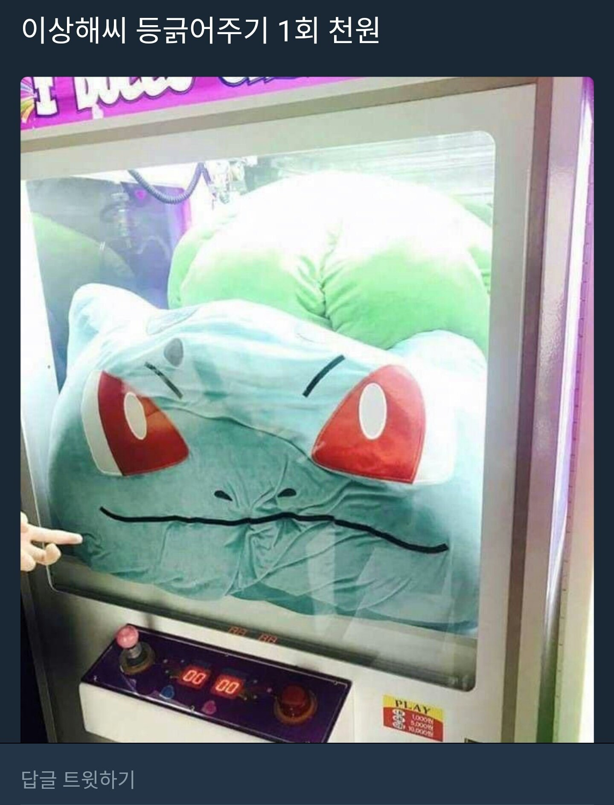

# 크레인 인형뽑기 게임

[문제 원본 프로그래머스에서 보기](https://programmers.co.kr/learn/courses/30/lessons/64061)

> 사진 출처: [오버워치 인벤](http://www.inven.co.kr/board/overwatch/4538/3289258)

## 🚀 문제 개요

2019 카카오 겨울 인턴쉽 코딩테스트에 나온 문제라 공식 풀이가 따로 존재 합니다.

> 보러가기: [Kakao Tech](https://tech.kakao.com/2020/04/01/2019-internship-test/)

### 주요 개념

- Stack
- 배열 메소드 활용

### 제한 사항

- board 배열은 2차원 배열로, 크기는 5x5 이상 30x30 이하입니다.
- board의 각 칸에는 0 이상 100 이하인 정수가 담겨져 있습니다.
- 0은 빈 칸을 나타냅니다.
- 1 ~ 100의 각 숫자는 각기 다른 인형의 모양을 의미하며, 같은 숫자는 같은 모양의 인형을 나타냅니다.
- moves 배열의 크기는 1 이상 1,000 이하입니다.
- moves 배열 각 원소들의 값은 1 이상이며 board 배열의 가로 크기 이하인 자연수 입니다.
